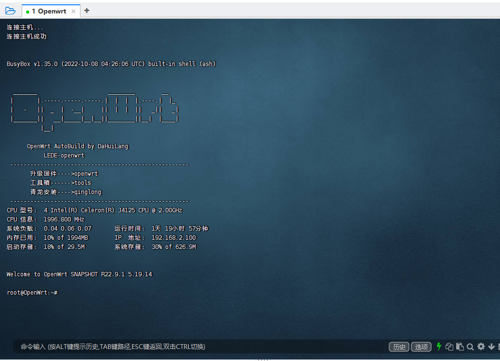
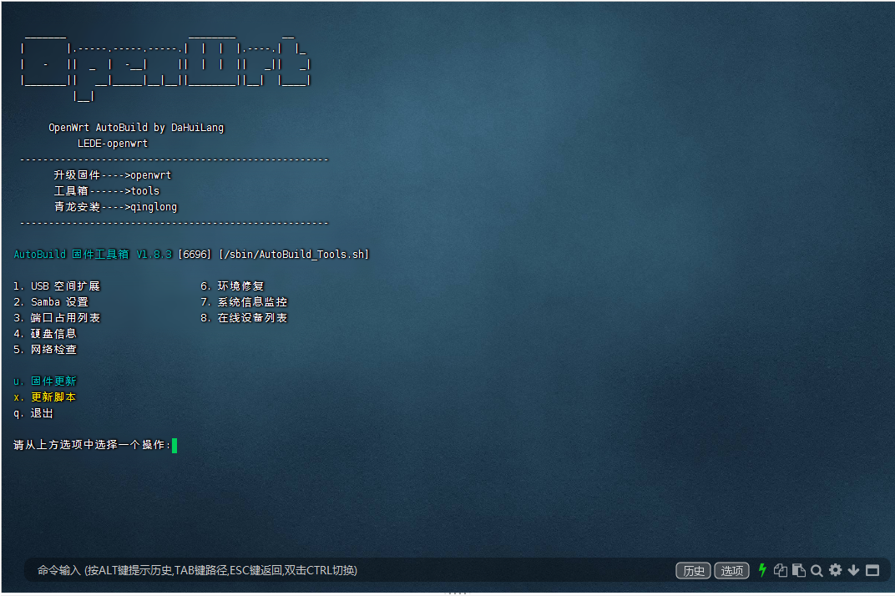
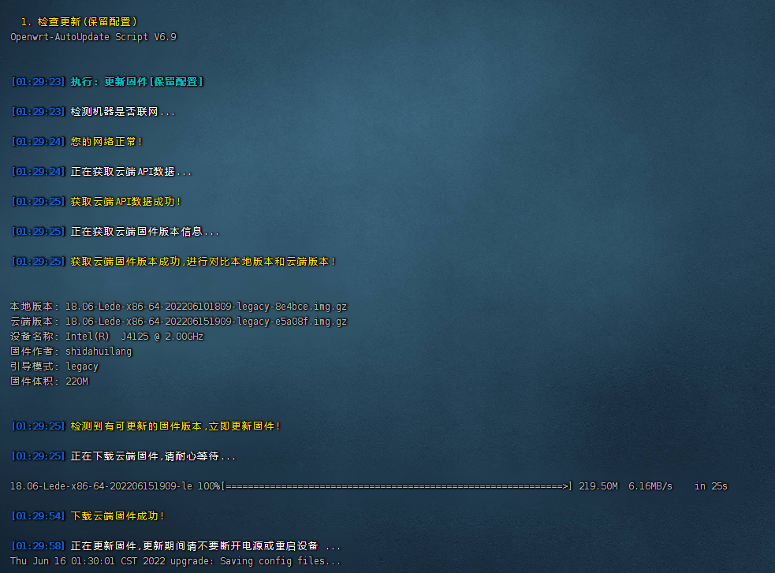
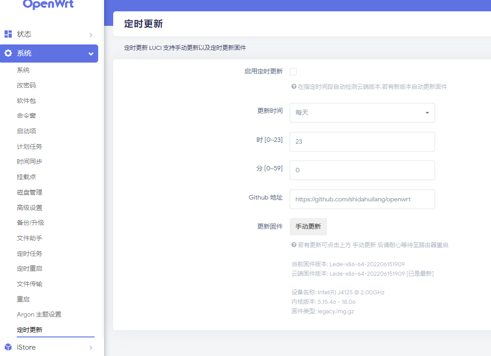

## `【大灰狼独家优化】（IPV6大全版  6.0 内核【带DOCKER】`
#### 🚩 源码拉取`coolsnowwolf` `Lienol` `immortalwrt` `x-wrt` `openwrt` 自行选择编译
- 大灰狼编译库`X86-R2C-R2S-R4S-R5S-N1-小米MI`等多系列全部适配OTA自动升级
- 默认IP地址：`192.168.2.1`
- 账户：`root`   密码：`空`
 
#### 🚩 点击下表中 [](https://github.com/shidahuilang/openwrt/releases) 即可跳转到该设备固件下载页面
| 平台+设备名称 | 固件编译状态 | 配置文件 | 固件下载 |
| :-------------: | :-------------: | :-------------: | :-------------: |
| [](https://github.com/shidahuilang/openwrt/blob/main/.github/workflows/Lede.yml) | [](https://github.com/shidahuilang/openwrt/actions/workflows/Lede.yml) | [](https://github.com/shidahuilang/openwrt/blob/main/build/Lede/seed/x86_64) | [](https://github.com/shidahuilang/openwrt/releases/tag/Update-x86) |
| [](https://github.com/shidahuilang/openwrt/blob/main/.github/workflows/Lede.yml) | [](https://github.com/shidahuilang/openwrt/actions/workflows/Lede.yml) | [](https://github.com/shidahuilang/openwrt/blob/main/build/Lede/seed/r2c) | [](https://github.com/shidahuilang/openwrt/releases/tag/Update-rockchip) |
| [](https://github.com/shidahuilang/openwrt/blob/main/.github/workflows/Lede.yml) | [](https://github.com/shidahuilang/openwrt/actions/workflows/Lede.yml) | [](https://github.com/shidahuilang/openwrt/blob/main/build/Lede/seed/r2s) | [](https://github.com/shidahuilang/openwrt/releases/tag/Update-rockchip) |
| [](https://github.com/shidahuilang/openwrt/blob/main/.github/workflows/Lede.yml) | [](https://github.com/shidahuilang/openwrt/actions/workflows/Lede.yml) | [](https://github.com/shidahuilang/openwrt/blob/main/build/Lede/seed/r4s) | [](https://github.com/shidahuilang/openwrt/releases/tag/Update-rockchip) |
| [](https://github.com/shidahuilang/openwrt/blob/main/.github/workflows/Lede.yml) | [](https://github.com/shidahuilang/openwrt/actions/workflows/Lede.yml) | [](https://github.com/shidahuilang/openwrt/blob/main/build/Lede/seed/r5s) | [](https://github.com/shidahuilang/openwrt/releases/tag/Update-rockchip) |
| [](https://github.com/shidahuilang/openwrt/blob/main/.github/workflows/Lede.yml) | [](https://github.com/shidahuilang/openwrt/actions/workflows/Lede.yml) | [](https://github.com/shidahuilang/openwrt/blob/main/build/Lede/seed/n1) | [](https://github.com/shidahuilang/openwrt/releases/tag/20230723055753) |
| [](https://github.com/shidahuilang/openwrt/blob/main/.github/workflows/Lede.yml) | [](https://github.com/shidahuilang/openwrt/actions/workflows/Lede.yml) | [](https://github.com/shidahuilang/openwrt/blob/main/build/Lede/seed/phicomm_k2p) | [](https://github.com/shidahuilang/openwrt/releases/tag/a20230723075212) |


- ================================================================
- 首先需要打开 Openwrt 主页,点击系统-TTYD 命令窗,或者使用```putty```或者```openwrt```后台luci插件在线更新 
- 输入`openwrt`即可进入固件升级菜单                            
- 输入`tools`即可打开工具箱
- 输入`qinglong`即可全自动安装青龙 
- ================================================================

- 自行云编译固件姿势
- ssh-actions改为ssh就可以启动插件选择
- 看到ssh链接会有一个web的链接，打开就是命令行，根据下面命令进入
- 开始 ctrl+c 
- 进ssh选择插件 
``` bash
cd openwrt && make menuconfig
```
- 结束ctrl+d
- REPO_TOKEN密匙制作教程：https://git.io/jm.md
- 云编译需要 [在此](https://github.com/settings/tokens) 创建个```token```,勾选：```repo```, ```workflow```，保存所得的key
- 然后在此仓库```Settings```->```Secrets```中添加个名字为```REPO_TOKEN```的Secret,填入token获得的key

- TG通知```Settings```->```Secrets```中添加个名字为```TELEGRAM_BOT_TOKEN```和```TELEGRAM_CHAT_ID```

## 自动更新固件






[](https://starchart.cc/shidahuilang/openwrt)
 ### 鸣谢！
 感谢以下各位大佬（排名无分先后）<br />
[`coolsnowwolf`]
[`danshui`]
[`Lienol`]
[`immortalwrt`]
[`P3TERX`]
[`Hyy2001X`]


