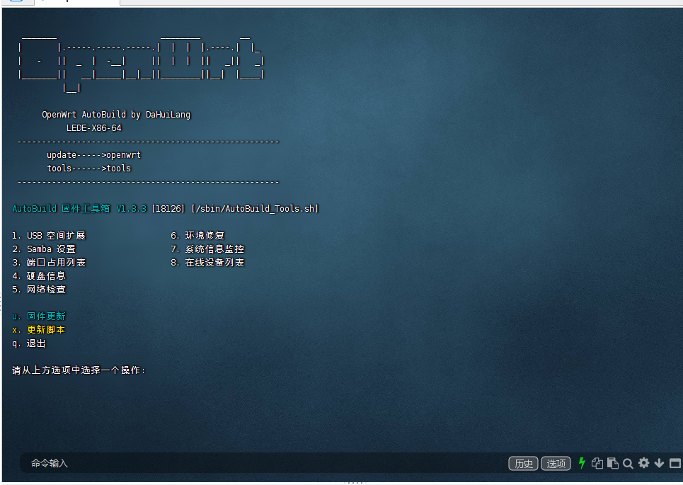

- 大灰狼编译库X86-R2S-R4S-MI等多系列全部适配OTA自动升级
- 默认IP地址：192.168.2.1
- 账户：root   密码：空
- ================================================================
- 首先需要打开 Openwrt 主页,点击系统-TTYD 终端或命令窗,或者使用putty 
- 输入```openwrt```即可进入固件升级菜单                            
- 输入```tools```即可打开工具箱                                    
- ================================================================
- 开始 ctrl+c 
- 进ssh选择插件 
``` bash
cd openwrt && make menuconfig
```
- 结束ctrl+d

- 云编译需要 [在此](https://github.com/settings/tokens) 创建个token,勾选：repo, workflow，保存所得的key
- 然后在此仓库Settings->Secrets中添加个名字为```REPO_TOKEN```的Secret,填入token获得的key

- TG通知Settings->Secrets中添加个名字为```TELEGRAM_BOT_TOKEN```和```TELEGRAM_CHAT_ID```

## 自动更新固件




